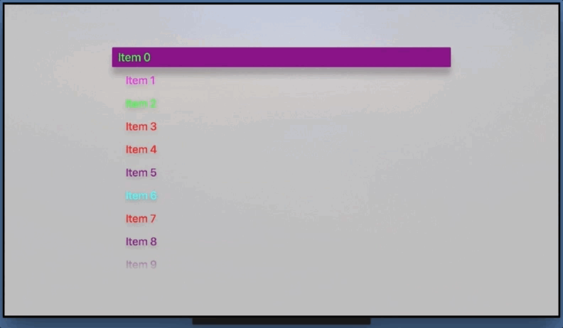

# TvOSCustomizableTableViewCell

Light wrapper of UITableViewCell that allows extra customization for tvOS



## Description

TvOSCustomizableTableViewCell allows the customization of UITableViewCells in tvOS, adding extra properties to customize layout attributes which are not customizable on UITableViewCells out of the box.

Custom properties:

- Focused background color
- Unfocused background color
- Corner radius
- Scale factor when focused
- Shadow radius when focused
- Shadow opacity when focused
- Shadow color
- Shadow offset when focused
- Duration of the focus animation
- Title color when focuses/unfocused

Two color, linear gradient properties:

- Focused background end color
- Unfocused background end color
- gradient start & end points

A simple two color, linear gradient can be configured by setting either "background end" color properties. If neither "background end" color properties are set then TvOSCustomizableViewCell will use a solid background color by default.

## Requirements

- tvOS 9.0+
- Xcode 8.2

## Installation

### CocoaPods

To integrate TvOSCustomizableViewCell into your Xcode project using CocoaPods, specify it in your `Podfile`:

```ruby
source 'https://github.com/CocoaPods/Specs.git'
platform :tvos, '9.0'
use_frameworks!

target '<Your Target Name>' do
    pod 'TvOSCustomizableTableViewCell', :git => 'https://github.com/zattoo/TvOSCustomizableTableViewCell.git'
end
```

### Manually

If you prefer, you can also integrate TvOSCustomizableViewCell into your project manually, just copying TvOSCustomizableViewCell.swift and GradientView.swift to your project.

## Usage

TvOSCustomizableViewCell can be integrated both programmatically or embedded in a xib file.

- [Using TvOSCustomizableTableViewCell programmatically](docs/UsageProgramatically.md)
- [Using TvOSCustomizableTableViewCell embedded in a xib or storyboard file](docs/UsageStoryboad.md)


