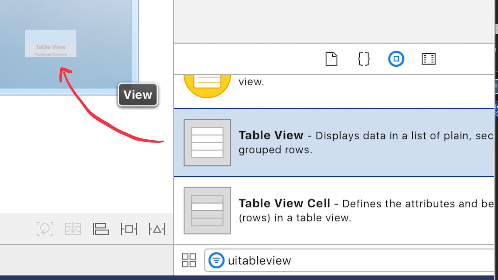
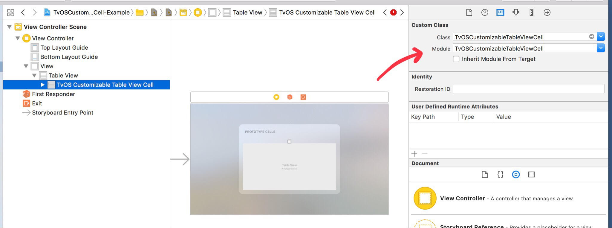
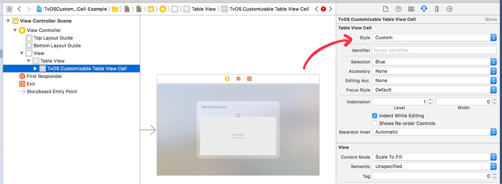
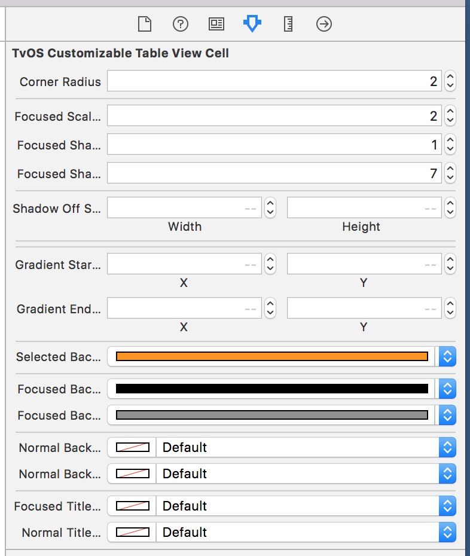

# TvOSCustomizableTableViewCell

Light wrapper of UITableViewCell that allows extra customization for tvOS


## Description

TvOSCustomizableTableViewCell allows the customization of UITableViewCells in tvOS, adding extra properties to customize layout attributes which are not customizable on UITableViewCells out of the box.

Custom properties:

- Focused background color
- Unfocused background color
- Corner radius
- Scale factor when focused
- Shadow radius when focused
- Shadow opacity when focused
- Shadow color
- Shadow offset when focused
- Duration of the focus animation
- Title color when focuses/unfocused

Two color, linear gradient properties:

- Focused background end color
- Unfocused background end color
- gradient start & end points

A simple two color, linear gradient can be configured by setting either "background end" color properties. If neither "background end" color properties are set then TvOSCustomizableViewCell will use a solid background color by default.

## Requirements

- tvOS 9.0+
- Xcode 8.2

## Installation

### CocoaPods

To integrate TvOSCustomizableViewCell into your Xcode project using CocoaPods, specify it in your `Podfile`:

```ruby
source 'https://github.com/CocoaPods/Specs.git'
platform :tvos, '9.0'
use_frameworks!

target '<Your Target Name>' do
    pod 'TvOSCustomizableTableViewCell', :git => 'https://github.com/zattoo/TvOSCustomizableTableViewCell.git'
end
```

### Manually

If you prefer, you can also integrate TvOSCustomizableViewCell into your project manually, just copying TvOSCustomizableViewCell.swift and GradientView.swift to your project.

## Usage

TvOSCustomizableViewCell can be integrated both programmatically or embedded in a xib file.

## Programmatically

TvOSCustomizableViewCell is a subclass of UITableViewCell, so it can be created and used as a regular TvOSCustomizableViewCell.

Example:
```swift
class ViewController: UIViewController, UITableViewDataSource {

    private var tableView: UITableView!
    var dataSource: UITableViewDataSource

    // MARK: UIViewController

    override func viewDidLoad() {
        super.viewDidLoad()
        setUpTableView()
    }

    // MARK: UITableViewDataSource
    
    func tableView(_ tableView: UITableView, numberOfRowsInSection section: Int) -> Int {
        return 10
    }

    func tableView(_ tableView: UITableView, cellForRowAt indexPath: IndexPath) -> UITableViewCell {
        let cell = tableView.dequeueReusableCell(withIdentifier: "Cell", for: indexPath) as! TvOSCustomizableTableViewCell

        cell.textLabel?.text = "Item \(indexPath.row)"
        cell.focusedTitleColor = .black
        cell.focusedBackgroundColor = .white
        cell.focusedScaleFactor = 1.05

        return cell
    }

    // MARK: Private

    private func setUpTableView() {
        tableView = UITableView()
        tableView.frame = view.bounds
        tableView.dataSource = self
        tableView.register(TvOSCustomizableTableViewCell.self, forCellReuseIdentifier: "Cell")
        view.addSubview(tableView)
    }
}
```

## Embedded in a xib or storyboard file

Due to the fact that TvOSCustomizableTableViewCell is a subclass of UITableViewCell, the first step is to drag and drop a regular UITableView from the Object library to your view.



Then change the value of "Custom Class" to "TvOSCustomizableTableViewCell", and the cell type to "Custom" to avoid the default focus behavior.

 

And that's all...

The custom properties can be configured directly on the Storyboard using IBInspectables.



